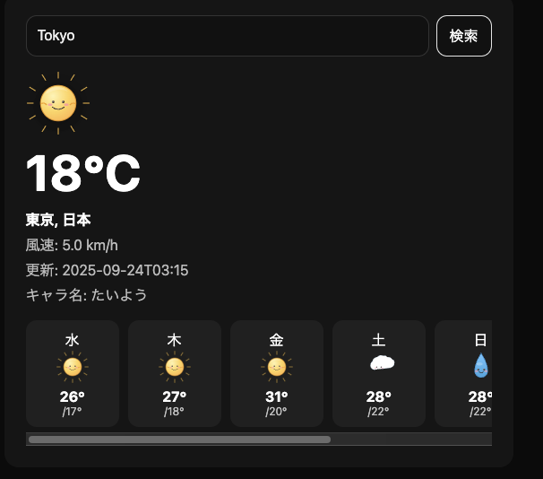

# 🌤️ Weather Forevcast

A simple weather forecast app built with **FastAPI** and the **Open-Meteo API**.  
It shows the **current weather** and a **7-day forecast**, with cute character-style SVG icons (sun, cloud, rain).

---

## 📸 Screenshot

Here is what the app looks like:



---

## 🚀 Setup

```bash
git clone https://github.com/YOUR_USERNAME/weather-forevcast.git
cd weather-forevcast
pip install -r requirements.txt
uvicorn main:app --reload --port 8000
